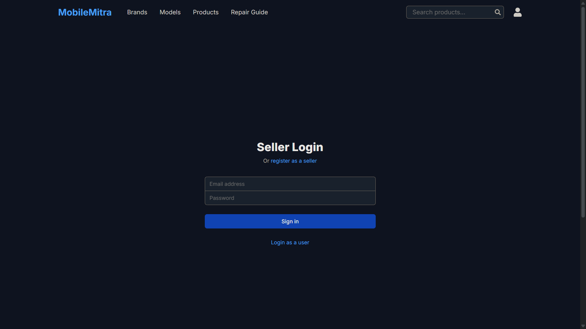
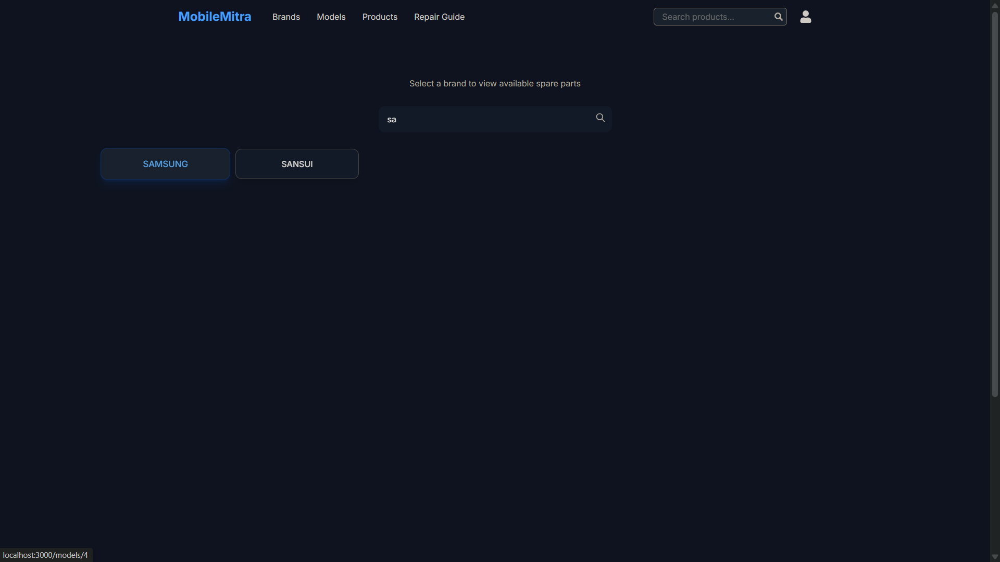

# MobileMitra - Mobile Parts E-commerce Platform

MobileMitra is a full-stack multi vendor e-commerce platform specializing in mobile phone parts and repair services. Built with Django REST Framework backend and Next.js frontend, it provides a seamless experience for both users and sellers.

## Features

### User Features
- **Authentication**
  - User registration and login
  - JWT-based authentication
  - Separate user and seller accounts
  - Profile management with editable fields

- **Shopping Experience**
  - Browse mobile parts by brands and models
  - Detailed product pages with specifications
  - Shopping cart functionality
  - Wishlist for saving items
  - Search functionality for products

- **Repair Guide**
  - Access to repair guides and tutorials
  - Step-by-step repair instructions

### Seller Features
- **Account Management**
  - Seller registration and login
  - Store profile management
  - Business information handling

- **Product Management**
  - Add and manage products
  - Update inventory
  - Set prices and descriptions

## Tech Stack

### Backend
- **Framework**: Django & Django REST Framework
- **Database**: MySQL
- **Authentication**: JWT (JSON Web Tokens)
- **API**: RESTful API architecture

### Frontend
- **Framework**: Next.js 13+ with App Router
- **Styling**: Tailwind CSS
- **State Management**: React Hooks
- **Icons**: React Icons
- **HTTP Client**: Native Fetch API

## Setup Instructions

### Backend Setup

1. Navigate to the backend directory:
   ```bash
   cd backend
   ```

2. Create a virtual environment:
   ```bash
   python -m venv venv
   ```

3. Activate the virtual environment:
   - Windows:
     ```bash
     venv\Scripts\activate
     ```
   - Unix/MacOS:
     ```bash
     source venv/bin/activate
     ```

4. Install dependencies:
   ```bash
   pip install -r requirements.txt
   ```

5. Set up MySQL database:
   ```sql
   CREATE DATABASE mobilemitra CHARACTER SET utf8mb4 COLLATE utf8mb4_unicode_ci;
   ```
''If you face any difficulty in creating the database, you can directly import it using the mobilemitra.sql file located in the backend folder'''

6. Apply migrations:
   ```bash
   python manage.py makemigrations
   python manage.py migrate
   ```

7. Create a superuser:
   ```bash
   python manage.py createsuperuser
   ```

8. Run the development server:
   ```bash
   python manage.py runserver
   ```

### Frontend Setup

1. Navigate to the frontend directory:
   ```bash
   cd frontend
   ```

2. Install dependencies:
   ```bash
   npm install
   ```

3. Run the development server:
   ```bash
   npm run dev
   ```

## API Endpoints

### Authentication
- `POST /api/auth/register/user/` - Register new user
- `POST /api/auth/register/seller/` - Register new seller
- `POST /api/auth/login/` - User/Seller login
- `POST /api/auth/token/refresh/` - Refresh JWT token
- `GET /api/auth/profile/` - Get user profile
- `PUT /api/auth/profile/` - Update user profile

### Products
- `GET /api/products/` - List all products
- `GET /api/products/{id}/` - Get product details
- `POST /api/products/` - Add new product (Seller only)
- `PUT /api/products/{id}/` - Update product (Seller only)
- `DELETE /api/products/{id}/` - Delete product (Seller only)

### Cart & Wishlist
- `GET /api/cart/` - Get cart items
- `POST /api/cart/` - Add item to cart
- `PUT /api/cart/{id}/` - Update cart item
- `DELETE /api/cart/{id}/` - Remove from cart
- `GET /api/wishlist/` - Get wishlist items
- `POST /api/wishlist/` - Add to wishlist
- `DELETE /api/wishlist/{id}/` - Remove from wishlist

## Environment Variables

### Backend (.env)
```
DEBUG=True
SECRET_KEY=your_secret_key
DB_NAME=mobilemitra
DB_USER=your_db_user
DB_PASSWORD=your_db_password
DB_HOST=localhost
DB_PORT=3306
```

### Frontend (.env.local)
```
NEXT_PUBLIC_API_URL=http://localhost:8000
```

## Contributing

1. Fork the repository
2. Create your feature branch (`git checkout -b feature/AmazingFeature`)
3. Commit your changes (`git commit -m 'Add some AmazingFeature'`)
4. Push to the branch (`git push origin feature/AmazingFeature`)
5. Open a Pull Request


## Acknowledgments
- Django REST Framework
- Next.js
- Tailwind CSS
- React Icons 

## Screenshots








